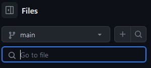

# BeeCrowd-Guide
<h1 align='center'>
	REPOSITÓRIO COMUNITÁRIO DESTINADO A RESOLUÇÃO DE QUESTÕES DO BEECROWD
	</h1>

# Início

- Esse repositório foi criado com o intuito de ajudar estudantes que estão iniciando na programação e/ou precisem de ajuda em questões da plataforma BeeCrowd (beecrowd.com.br)
- O repositório será alimentado com questões em múltiplas linguagens.
- A comunidade conta com o apoio de todos para crescermos ainda mais essa comunidade.

# Como acessar o banco de questões:

- Haverão pastas destinadas a cada categoria de problemas do Beecrowd (Iniciante, AD-HOC, etc);
- Cada pasta conterá a linguagem de programação usada para resolução da questão, por ela você poderá acessar todas as questões resolvidas.
- Você pode pesquisar a questão clicando na categoria desejada e pesquisando a respectiva questão

# Como pedir a resolução de uma questão:

- No repositório vá na opção 'issues'
- Clique no botão verde 'new issue'
- Escreva no título a questão desejada e a linguagem.
- Caso não consigamos resolver na linguagem desejada, contribuiremos com a resolução em alguma linguagem que a questão já tenha sido resolvida.

# Ao contribuir com o repositório:

- Para fins de organizarmos o envio de questões e diferenciar multiplos tipos de resolução, por favor, enviem o arquivo da questão como sendo: numerodaquestao_seunome.linguagem

